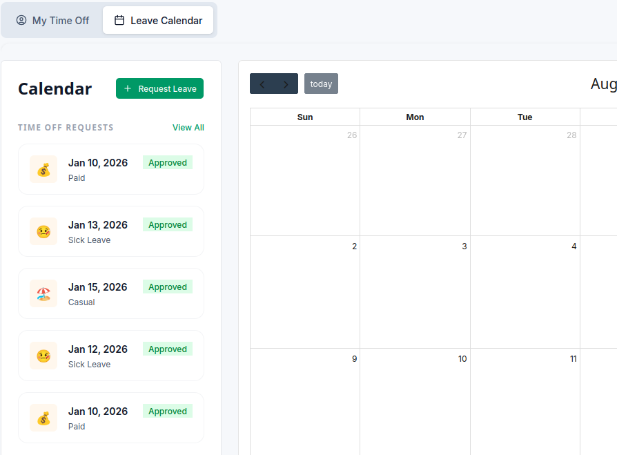
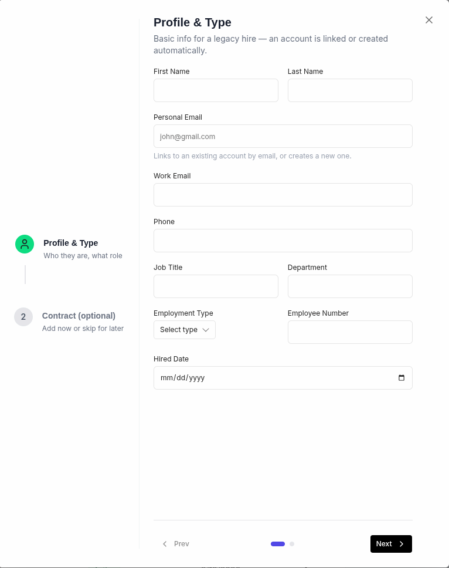
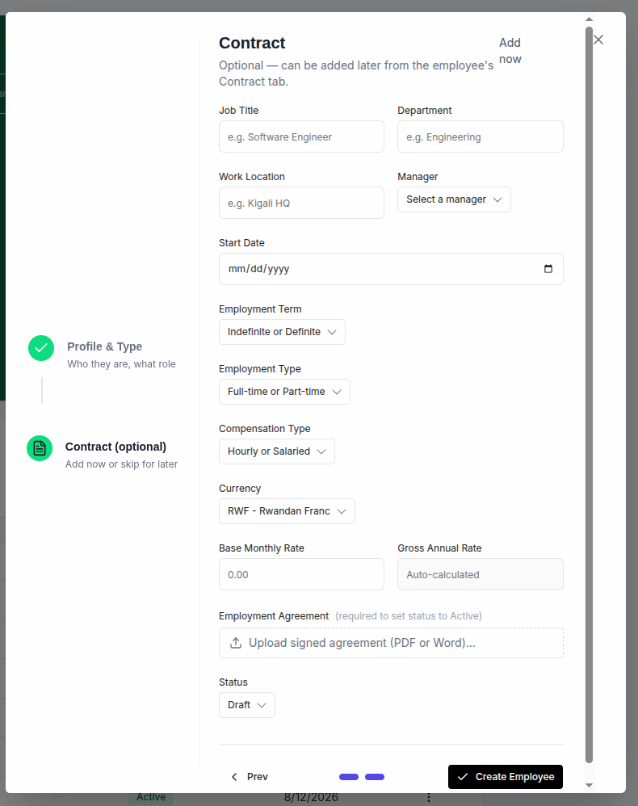
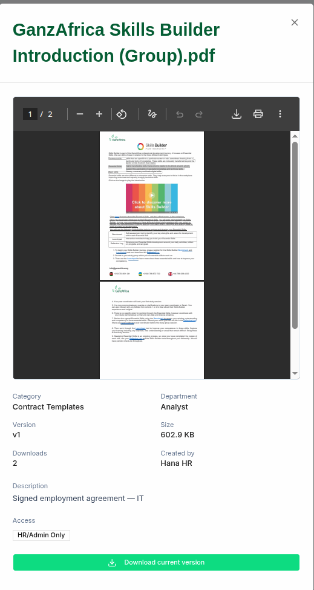
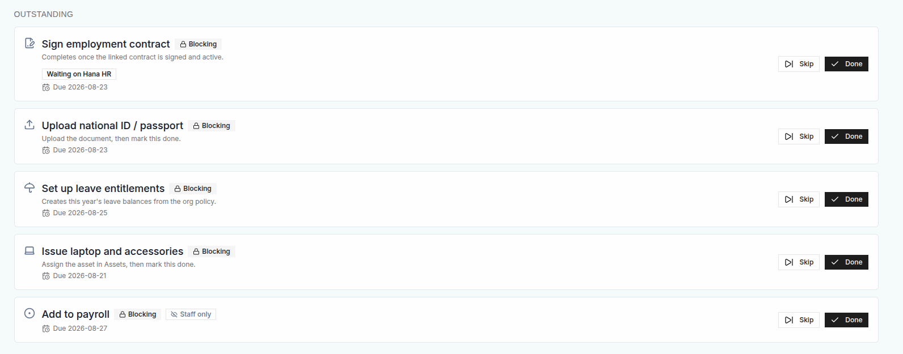
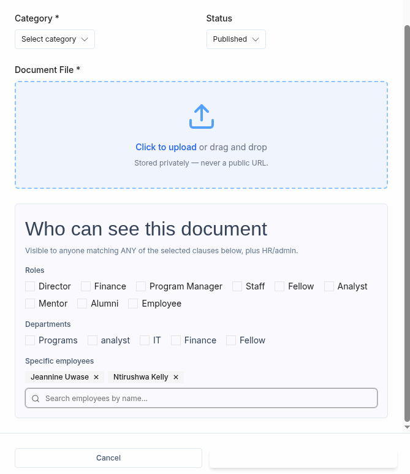

## THINGS TO WORK ON BEFORE Friday 21st Aug 2026

### Account deletion (Change this in both backend and frontend)

The ability to delete the use completely I want to change it to deactivating his/her account only

### pull the actual data on leave table + other tables with similar issue.

So far the leave table displays dummy data, I want you to change that. On the employee side I want them to see only the leaves of the employee they're assigned to(since they're the ones who are going to approve for them) and the leave they requested so far with their status (Approved, Pending or Rejected)
For HR they will be able to see the sme as the employee plus all leaves of all employees.
In the bellow I showed the section to modify leave the one bellow this(I mean Public Holidays and Annual leaves which should be displayed to both employee and HR).

### Update the HR landing page to display valid data from backend.

The landing page for HR should show: - for the headerStats display true fetched data from Backend and replace "Attendance ViewEmployeeContents" with "Alerts" which we'll work on later - true leaves summary data from Backend. - true employee status(pending, onboarding, active) keep the way the ui-circles looks only change numbers and display true number from Backend. - ongoing track card that shows the milestone of all employees. - For application track/ summary this first check if the Recruitment feature is fully integrated if not leave the section as it is if yes add real data from Backend. - Schedule section should display data from leave page not meetings and events, so display only a calendar with avatar of employees who are away. - System Alert this is a feature for it own leave if we shall work on it later.
As you can see most of the above landing page sections doesn't need ui modifications they need to display true data from the Backend.

### On the Personal Details page, some duplicated information should be removed when adding a personal profile.

when I create a person manually through "+ add employee" button inside the create employee sheet, **Profile & Type** step contains some similar information as **contract (optional)** step,
so I need you to depopulate these data or auto complete them, in case I move to **contract (optional)** step they should be already there completed in those fields.
see here: 

### Work on the email notification that is sent when an employee is added to the system.

When an employee is created/added to the system the backend sends an email to the user created, but the issue is theren't a way to see that on the frontend.
In adition when the employee is created for the first time, he/she should have a "Pending" status immediatly and when they start approving and signing the documents their status should switch to "Onboarding" and then "Active" once they're done their onboarding step.

### Under Documents page, modify the way the document is view(I want you to use PDFx).

Change the way we view the document frame, and use PDFx in the Sheet component as seen in this image.

### Add an indicator to show whether a document requires a signature.

As you can see on this image there's no way to view the document in case you want to read it before signing it, so add that way too. Plus I don't see no way to sign it even though we know that feature is implemented.
see here:

### Add the option to create a document template.

Add a way to design a document template through this system, so that in the future documents will have identical design based on their category.
A good place to add this feature is to put it inside the Category tab where I would be able to create a category and design how it should look, the primary colors are green, yellow, blue and orange.

### When creating a document, ensure that the text in the "Create Document" button is clearly visible.

Here I meant the last section of who can see this document, the texts look small compared to document file, status and category sections.
And this function on who see this document should work perfectly not just frontend thing but it should also be integrated and well working.
see here:
